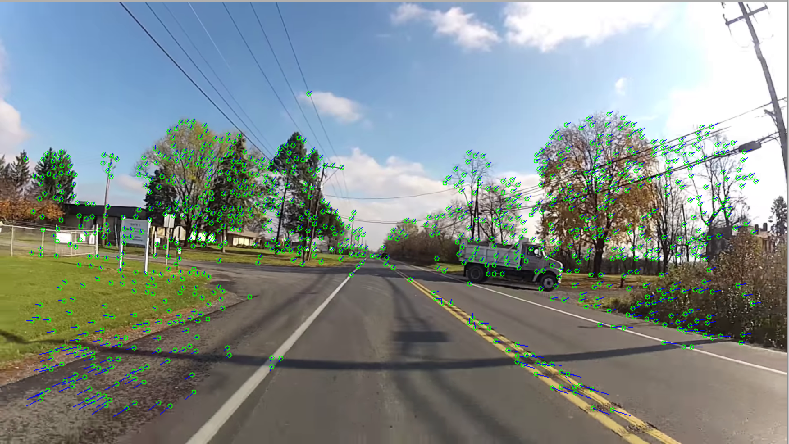

Inspired by George Hotz's twitch slam

Personal implementation of SLAM, hopefully I can implement some design principles to make it more elegant...

# Feature Extraction
- GoodFeatureToTrack for Keypoint
- ORB for Descriptor
- BFMatcher for Feature Matching

# Basic Design

*Controller*
- DLT, Triangulation
- FinchWalder Solution for 3D absolute pose estimation
- Bundle Adjustment, g2o

*View*
- 2D OpenCV Display
- 3D PyGame Reconstruction Display

*Model*
- Frame -> isKeyframe [(one-to-many)features, (one-to-one)pose]
- 2D / 3D Features [poses], Camera Pose [features]

# Library
[G2O (for bundle adjustment)](https://github.com/RainerKuemmerle/g2o)

