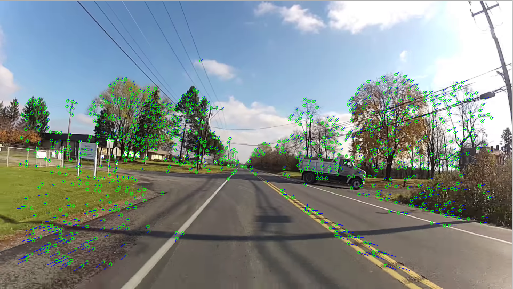

Inspired by George Hotz's twitch slam

Personal implementation of SLAM, hopefully I can implement some design principles to make it more elegant...

# Feature Extraction
- GoodFeatureToTrack for Keypoint
- ORB for Descriptor
- BFMatcher for Feature Matching

# Basic Design

*Controller*
- DLT, Triangulation
- FinchWalder Solution for 3D absolute pose estimation
- Bundle Adjustment, g2o

*View*
- 2D OpenCV Display
- 3D PyGame Reconstruction Display

*Model*
- Frame -> isKeyframe [(one-to-many)features, (one-to-one)pose]
- 2D / 3D Features [poses], Camera Pose [features]

# Progress
---
## First Phase:

* Build Data Structure for Point and Pose Maps. Use Dummy Imagining Geometry
* Use RANSAC outline rejections for initial matching.
* DLT for absolute pose estimation and fundamental matrix estimation
* Use Two view optimal triangulation for creating 3D feature points
* Bundle Adjustment

---

## Second Phase:

* RANSAC for absolute pose estimation
* Add Keyframes and Loop Closure
* 3D Visualization
* Essential Matrix

# Library
[Pangolin (for 3D Visualization Library)]
[G2O (for bundle adjustment)](https://github.com/RainerKuemmerle/g2o)

# ScreenShot

